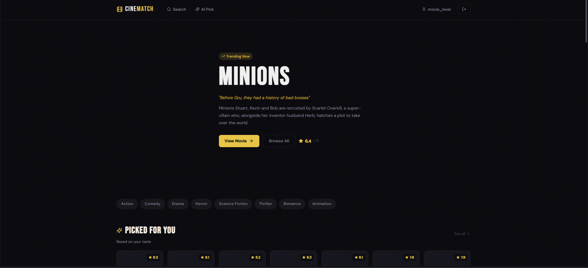
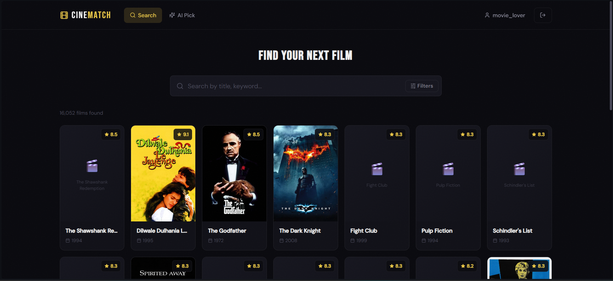
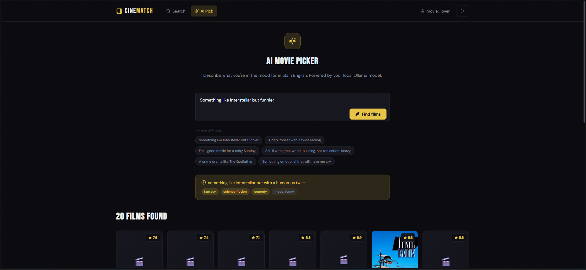
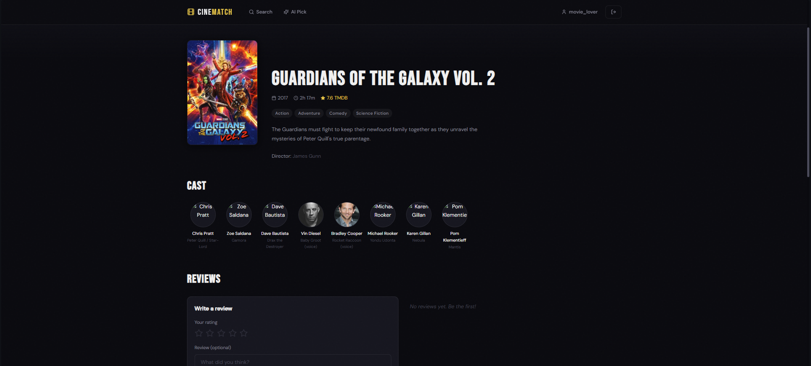
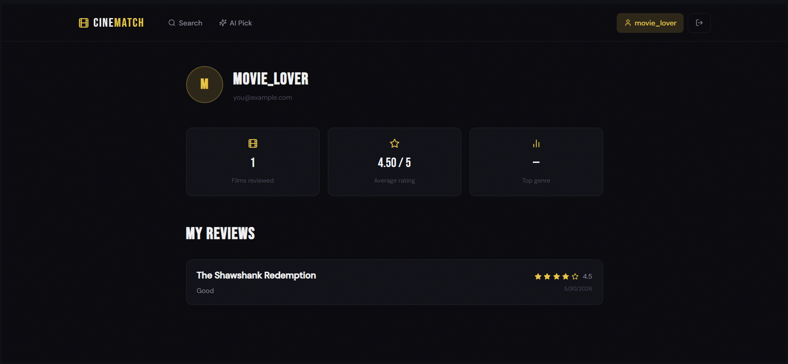

# 🎬 CineMatch

[](https://github.com/AdithyaRaoK14/cinematch-ai-movie-recommendation-system/actions/workflows/tests.yml)
[](https://www.python.org/)
[](https://fastapi.tiangolo.com/)
[](https://react.dev/)
[](https://www.docker.com/)
[](https://ollama.com/)
[](LICENSE)

AI-powered movie recommendation platform built with React, FastAPI, PostgreSQL, Docker, and Ollama. CineMatch combines collaborative filtering, content-based recommendation, and natural language search to help users discover movies through both traditional filtering and conversational AI.

---

## Features

* Natural language movie discovery using local Ollama models
* Hybrid recommendation engine
* Collaborative filtering using TruncatedSVD
* Content-based movie similarity
* IMDb-style weighted ranking
* Personalized recommendations
* Movie reviews and ratings
* JWT authentication
* Dockerized deployment
* Responsive React frontend
* Swagger API documentation

---

## Screenshots

### Home



### Search



### AI Search



### Movie Detail



### Profile



---

## Tech Stack

| Layer            | Technology                           |
| ---------------- | ------------------------------------ |
| Frontend         | React, Vite, Zustand, TanStack Query |
| Backend          | FastAPI, SQLAlchemy, PostgreSQL      |
| Authentication   | JWT                                  |
| Machine Learning | Scikit-Learn TruncatedSVD            |
| AI Search        | Ollama                               |
| Dataset          | Kaggle The Movies Dataset            |
| Containerization | Docker Compose                       |

---

## Dataset

Dataset source:

https://www.kaggle.com/datasets/rounakbanik/the-movies-dataset

Download and extract the dataset.

Required files:

```text
movies_metadata.csv
credits.csv
keywords.csv
ratings_small.csv
links_small.csv
```

Place them inside:

```text
backend/app/data/
```

Final structure:

```text
backend/app/data/
├── movies_metadata.csv
├── credits.csv
├── keywords.csv
├── ratings_small.csv
└── links_small.csv
```

The original dataset contains approximately 45,000 movies. CineMatch filters and cleans the data to produce a curated searchable catalog of roughly 16,000 high-quality movies.

---

## Environment Variables

Create a `.env` file from `.env.example`.

Example:

```env
POSTGRES_USER=cinematch
POSTGRES_PASSWORD=your_postgres_password
POSTGRES_DB=cinematch

SECRET_KEY=your_secret_key_here

OLLAMA_BASE_URL=http://host.docker.internal:11434
OLLAMA_MODEL=llama3.2:3b
```

Optional:

```env
OLLAMA_MODEL=qwen2.5:7b
```

Use qwen2.5:7b only on systems with sufficient RAM.

---

## Install Ollama

Install Ollama:

https://ollama.com

Start Ollama:

```bash
ollama serve
```

Pull the default model:

```bash
ollama pull llama3.2:3b
```

---

## Run with Docker

From the project root:

```bash
docker compose up --build -d
```

Open:

```text
Frontend:
http://localhost:3000

Swagger Docs:
http://localhost:8000/docs
```

First startup may take a few minutes while datasets are loaded and recommendation models are trained.

---

## Run Without Docker

### Backend

```bash
cd backend

python -m venv venv

# Windows
venv\Scripts\activate

pip install -r requirements.txt

uvicorn app.main:app --reload --port 8000
```

### Frontend

```bash
cd frontend

npm install

npm run dev
```

Open:

```text
http://localhost:5173
```

---

## How Recommendations Work

### Collaborative Filtering

Uses TruncatedSVD on real user ratings from MovieLens.

The model learns latent user preferences and recommends movies based on users with similar viewing behavior.

---

### Content-Based Recommendation

Uses:

* Genres
* Keywords
* Cast
* Directors

to identify similar movies.

---

### AI Natural Language Search

Example:

```text
Something like Interstellar but funnier
```

The local Ollama model extracts:

```json
{
  "genres": ["science fiction", "comedy"],
  "mood": "funny",
  "keywords": ["space", "time travel"]
}
```

The recommendation engine then:

1. Finds movies similar to referenced titles
2. Applies AND-based genre matching
3. Uses keyword similarity
4. Filters low-signal movies
5. Ranks results using IMDb-style weighted scoring
6. Generates AI explanations for top matches

---

## Recommendation Improvements

CineMatch includes:

* AND genre matching
* Reference movie keyword extraction
* IMDb weighted ranking
* Vote-count filtering
* Collaborative filtering recommendations
* Content similarity scoring
* Natural language AI search

These techniques improve recommendation quality and reduce obscure or low-signal results.

---

## Project Structure

```text
cinematch-ai-movie-recommendation-system/
├── .env.example
├── docker-compose.yml
├── README.md
│
├── backend/
│   ├── Dockerfile
│   ├── requirements.txt
│   └── app/
│       ├── api/
│       ├── core/
│       ├── db/
│       ├── ml/
│       ├── models/
│       ├── schemas/
│       ├── services/
│       └── data/
│
├── frontend/
│   ├── Dockerfile
│   ├── src/
│   │   ├── pages/
│   │   ├── components/
│   │   ├── store/
│   │   └── styles/
│
└── scripts/
```

---

## Common Issues

### AI Search Failed

Make sure:

```bash
ollama serve
```

is running and the configured model is installed.

---

### Movies Not Loading

Verify all dataset files exist inside:

```text
backend/app/data/
```

---

### Slow First Request

The first request loads datasets and recommendation models into memory.

Subsequent requests are significantly faster.

---

### Missing Posters

Movie posters are loaded from TMDB's public image CDN and require internet access.

---


## License

MIT License
